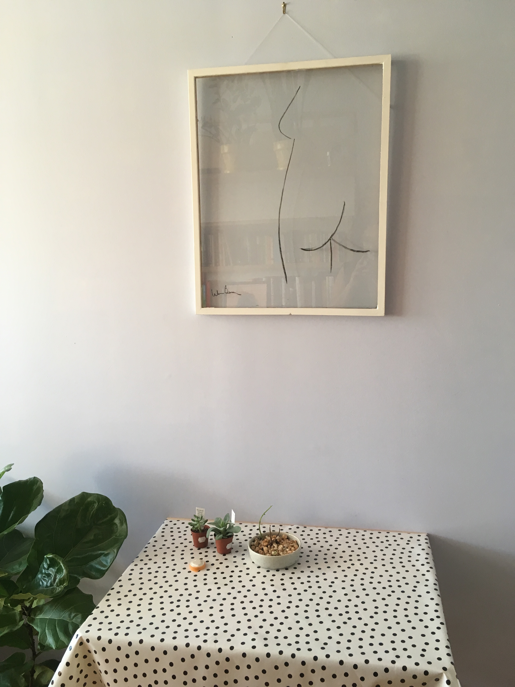

# Zine Interview

*Can we see a picture of your workspace and/or desktop*?

 

I switch between the butt and the books, depending on whether I need calming or friends.
 
***

*Where are you typing this from*?

Please note the very fancy cable fix.

***

*What do you watch/listen to while working*?

My taste is terrible and I am still mourning the loss of all the great Rdio playlists I once had.

***

*What have you been working on lately*?

[My thesis!](http://www.lost-time.club/)

***

*What work of yours are you most proud of*? 

Smell-o-gram is an augmented reality piece I made that projects you enjoying smells (only good ones!) that are evocative for me. I like that it is both physical and digital.

***

*What tools do you use in your work*?

***

*Can you tell us about your process*?

[src](https://giphy.com/gifs/ySeRvSe4c1mRq)

***

*Any last advice for the folks just starting out*? 

[src](https://giphy.com/gifs/animated-dancing-inflatable-12dpLtkNiqc5zO)

***

*Top five most influential visuals*?

Olivia Sautreuil

Dear Data by Giorgia Lupi and Stefanie Posavec

Sentence Drawings by Stefanie Posavec

Nightly Sleep Analyzed by Laurie Frick

Me

***

**Part II**.

*Favorite file formats*?

*.js 

***

*What are the best places to see your work*?

[On my real cool website.](http://sarahghp.com/projects/index.html)

***

*What sites do you visit for inspiration*?

[Twitter](https://twitter.com/) — So many good art accounts, especially @LinaresFreire (https://twitter.com/LinaresFreire), plus my friends are always finding/making the best shit.

[Door Sixteen](http://www.doorsixteen.com/) — Always great patterns and colors, plus pretty interiors.

[Apartment Therapy](http://www.apartmenttherapy.com/) and [Girl By Bay](http://www.sfgirlbybay.com/) — I love seeing the art people have in their apartments, plus both have a dose of that California vibe — about which I have a lot of contradictory feelings!

***

*Whose work do you follow*?

I am not organized enough to really follow anyone. But lately I have enjoyed stuff by Dana Schutz, Dianna Molzan, and Jorinda Voight, according to my phone.

***

*What are your favorite galleries, museums, exhibits, etc*.?

The [School for Poetic Computation](http://sfpc.io/) changed my life and the way I think about art and tech. I go back for all their end of term shows and other events.

[Buy Some Damn Art](http://www.buysomedamnart.com/)

[Los Ojos](http://losojosbk.com/)

[Transmitter](http://www.transmitter.nyc/)

[Flux Factory](http://www.fluxfactory.org/)

[Konig Gallerie](http://www.koeniggalerie.com/)

And I love that MoMA and the Whitney have artists memberships, which means that even while I am in grad school I can go as much as I want.

Show-wise this year I really liked the MoMA 60s show, Carmen Herrera and Stuart Davis at the Whitney and Denver Art Museum’s Women of Abstract Expressionism. The new SFMoMA was also fun, especially the Ellsworth Kelly and Agnes Matin rooms. I’m looking forward to Agnes Martin at the Guggenheim.

***

*Last but not least: an Avatar*!
